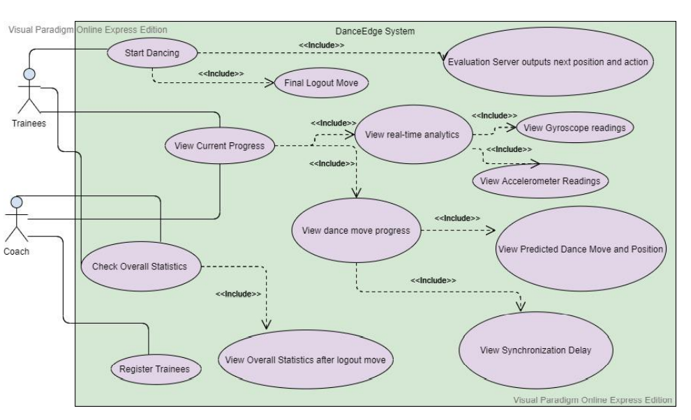
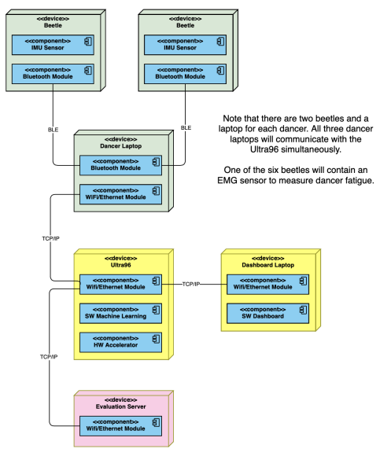
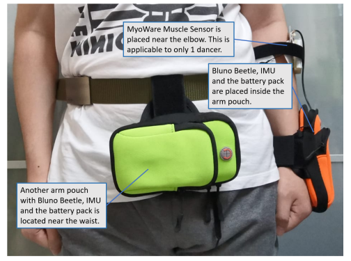

# Smart-Dance-Wearable-System

##### For in-depth details, please look at the `B18 Final Report.pdf` document. 

## Project Description

### Introduction
Wearables provide a way for detecting human activity automatically, and have been used in wide-ranging scenarios. Fitness tracking is likely the most prevalent use of activity detection. Using wearables such as smartwatches or fitness trackers, users can monitor their step count, as well as more advanced sports training such as stride and pace for running, strike force for tennis, stance for basketball etc. Activity detection has also been used in medical scenarios, such as detecting falls or anomalous movements that indicate medical conditions. In our daily life, activity detection has been applied to infer our minute-by-minute activities at home, during commute, at work or school, while shopping, exercising, etc.

In this project, the goal is simple – design a wearable system that can detect, and coach 
dancers as they dance!

### Problem Statement:
A wearable system that detects and coaches dance moves of a dance group

### Main requirements to be accomplished:
- A wearable device and system to be designed to coach the dancers as they perfect and 
synchronize the dance moves.
- Three dancers will move into the specified relative positions, then perform each 
specific dance move shown on the server screen.
- Server will display a randomly selected routine of 8 different dance moves with 
relative positions of dancers on the screen. For instance, the screen will show:

  `DanceMove1
  Locations: 1 2 3`
  Initial position with all 3 dancers facing the screen, all dancing DanceMove1.

  `DanceMove2
  Locations: 2 1 3`
  Facing the screen, Dancer 1 will move to the right, Dancer 2 will move to the left, and 
  Dancer 3 remains in the same position, then all 3 dancers will perform DanceMove2.

- For each dance move, the wearable system will respond to the evaluation server with 
the predicted dance move, dancers’ relative locations, and how synchronized the 
dancers are (time in ms from when the earliest dancer starts the dance move to when 
the latest dancer starts dancing the move). Evaluation server script will be provided.

- Wearable automatically detects these dance moves (Check out videos of dance moves 
on LumiNUS), the dancers’ positions, and how synchronized they are with each other.

- The wearable system should work when worn by anyone and used anywhere (i.e. no 
infrastructure sensors), even when the three dancers are dancing in separate physical 
locations (virtual CG4002).

- The system should be realized with the hardware platforms provided: Arduino Beetles 
and Ultra96 FPGA board. Each group’s Ultra96 FPGA board will be housed in 
Makers@SoC lab and accessible remotely via an IP address that will be provided, 
enabling virtual CG4002.

- The system should communicate the system’s outputs to the class evaluation server in 
a secure manner. (The wireless interface with the server will be published)
- One wearable should have a sensor that measures the muscle fatigue of a dancer so as 
to track the fitness level of the dancers.
- The system must include a coaching dashboard that accepts in real-time information 
from the wearable system so as to provide analytics feedback to dancers. This 
dashboard can run on your own server or in the cloud, but needs to support secure 
access.
- The wearable should track timing information as feedback to the dancers on how 
synchronized they are in performing the dance moves, and send the timing difference
between dancers starting a new move to the server for validation, and to the 
dashboard for feedback to dancers.


## User Story
### Coach
User stories from the point of view of a dance coach:
- [Priority: HIGH] I want to know if the members of my group are performing the right
actions so that I can guide them to better perform the routine
- [Priority: HIGH] I want to know if the members of my group are synchronised so that
I can advise which dancer to slow down or speed up
- [Priority: MEDIUM] I want to know how fatigued my group members are so that I
can analyse the strenuity of the dance actions
- [Priority: MEDIUM] I want to see if the overall performance and accuracy of my
group members after a dance routine so that I know who to focus my attention to
and coach individually

### Trainee
User stories from the point of view of a trainee:
- [Priority: HIGH] I want to know if I am doing the right dance move so that I can
better follow the routine
- [Priority: HIGH] I want to know if I am too slow or too fast from my other dance
members so that I adjust my movements to better synchronize the group’s
movement
- [Priority: HIGH] I want the wearable device to be power efficient so that I do not
have to frequently and inconveniently keep changing the batteries
- [Priority: HIGH] I want the wearable device to be lightweight and easy to put on so
that I not only feel comfortable wearing it for long periods of time but also not feel
restrained by it. Essentially, I would want to wear it because it makes me feel good.
- [Priority: MEDIUM] I want to know my overall statistics after a dance routine so that
I can pinpoint where to improve myself
- [Priority: MEDIUM] I want to be able to dance anywhere such that I do not have to
worry about COVID-19 physical interaction restrictions and still be able to learn to
dance
.
### Compliation of use cases
#### Use Case 1 - Correct Position and Dance Move
Main Success Scenario:
1. Coach logins in into DanceEdge dashboard and registers up to three trainees
who will be involved in dance coaching exercise.
2. Evaluation server outputs respective positions of each trainee along with an
action to perform.
3. Trainees will transit to their new position and perform the aforementioned action.
4. Dashboard visually shows their predicted position and action as well as the
real-time raw sensor data that was used to derive those predictions. In addition,
the synchronization delay between the trainees as well as muscle fatigue level
of one trainee will be displayed.
Use case ends

#### Use Case 2 - Final Logout Dance Action
Main Success Scenario:
1. Evaluation server outputs “Logout” and the positions the trainees should transit
to.
2. Trainees transit to their new position and perform final logout dance action.
3. Dashboard displays that the dance routine has come to an end. Trainees and
coaches can view their overall statistics for the dance exercises.
Use case ends



## Overall System Architecture



## Final Form of the System


## Brief Summary of the algorithms
### Algorithm To Classify Dance Moves
1. Collect data from wearable device on the hand
    - Sample the 3-axial acceleration and 3-axial gyroscope at 25Hz
    - Calculate the orientation angles yaw, pitch, and roll angle
    - Send data that contains acceleration, gyroscope, and angles to laptop via bluetooth
2. Transmit data on laptop to Ultra96
    - Send data that contains acceleration, gyroscope, and angles to Ultra96 via TCP in batch size of 5
3. Classify dance moves on Ultra96
    - Collect a window of 250 readings (about 10 seconds of data)
    - Perform feature extraction on the last 60 readings
    - Normalize the features
    - Infer the dance moves using deep learning model
    - Send inferences to evaluation server via TCP and dashboard via RabbitMQ

### Algorithm To Detect Dancer Positions
4. Collect data from wearable device on the waist
    - Sample the 3-axial acceleration and 3-axial gyroscope at 25Hz
    - Calculate the orientation angles yaw, pitch, and roll angle
    - Send data that contains acceleration, gyroscope, and angles to laptop via bluetooth
5. Transmit data on laptop to Ultra96
    - Send data that contains acceleration, gyroscope, and angles to Ultra96 via TCP in batch size of 5
6. Detect dancer positions on Ultra96
    - Find the index of the roll angle in the window that exceeds the threshold
    - Determine whether the dancer make a left or right turn
    - Compute the dancer positions from the turns
    - Send inferences to evaluation server via TCP and dashboard via RabbitMQ

### Algorithm To Measure Muscle Fatigue
7. Collect data from myoware sensor
    - Sample the EMG signals at 25Hz
    - Send data that contains the EMG signals to laptop via bluetooth
8. Train data to dashboard server
    - Send data to dashboard server via RabbitMQ

## Commands

First, ensure that you are inside the `Main Code` folder in your terminal.

Development
```
IP_ADDRESS=localhost EVAL_PORT=8000 DANCE_PORT=9000 IS_DASHBOARD=1 python3 ultra96.py
EVAL_PORT=8000 python3 eval_server.py
DANCE_PORT=9000 DANCER_ID=0 IS_DASHBOARD=1 IS_EMG=0 IS_POSITION=0 python3 laptop.py
DANCE_PORT=9000 DANCER_ID=0 IS_DASHBOARD=1 IS_EMG=0 IS_POSITION=1 python3 laptop.py
DANCE_PORT=9000 DANCER_ID=1 IS_DASHBOARD=1 IS_EMG=0 IS_POSITION=0 python3 laptop.py
DANCE_PORT=9000 DANCER_ID=1 IS_DASHBOARD=1 IS_EMG=0 IS_POSITION=1 python3 laptop.py
DANCE_PORT=9000 DANCER_ID=2 IS_DASHBOARD=1 IS_EMG=1 IS_POSITION=0 python3 laptop.py
DANCE_PORT=9000 DANCER_ID=2 IS_DASHBOARD=1 IS_EMG=1 IS_POSITION=1 python3 laptop.py
```

Production
```
ssh -i "govtech.pem" ubuntu@ec2-52-221-205-129.ap-southeast-1.compute.amazonaws.com
ssh -L 9000:localhost:9000 -J e0315868@sunfire.comp.nus.edu.sg xilinx@makerslab-fpga-18
IP_ADDRESS=localhost EVAL_PORT=8000 DANCE_PORT=9000 IS_DASHBOARD=1 python3 ultra96.py
EVAL_PORT=8000 python3 eval_server.py
DANCE_PORT=9000 DANCER_ID=0 IS_DASHBOARD=1 IS_EMG=0 IS_POSITION=0 python3 laptop.py
DANCE_PORT=9000 DANCER_ID=0 IS_DASHBOARD=1 IS_EMG=0 IS_POSITION=1 python3 laptop.py
DANCE_PORT=9000 DANCER_ID=1 IS_DASHBOARD=1 IS_EMG=0 IS_POSITION=0 python3 laptop.py
DANCE_PORT=9000 DANCER_ID=1 IS_DASHBOARD=1 IS_EMG=0 IS_POSITION=1 python3 laptop.py
DANCE_PORT=9000 DANCER_ID=2 IS_DASHBOARD=1 IS_EMG=1 IS_POSITION=0 python3 laptop.py
DANCE_PORT=9000 DANCER_ID=2 IS_DASHBOARD=1 IS_EMG=1 IS_POSITION=1 python3 laptop.py
```
